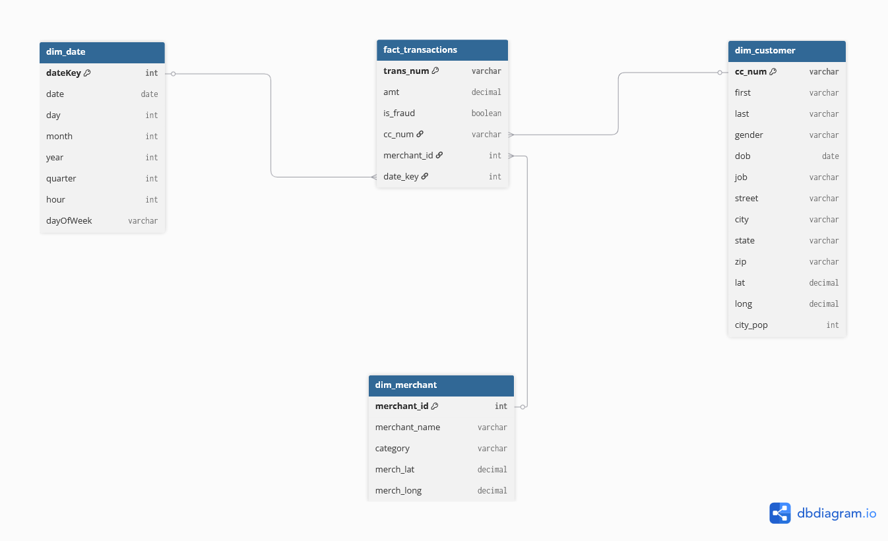

# Fintech Data Warehouse - Dimensional Modeling

## 1. Context
This project simulates a Data Warehouse for a fintech company that processes financial transactions. The goal is to design a dimensional model that supports analytical queries related to transactions and fraud detection.

This project focuses exclusively on dimensional modeling — schema design, grain definition, and pipeline structure. Query implementation is out of scope and would be handled by the analytics or BI layer built on top of this model.

---

## 1.1 Datasets
https://www.kaggle.com/datasets/kartik2112/fraud-detection

Attention: this dataset was originally created for ML training purposes by kartik2112. For this project, the train/test split was disregarded as it is irrelevant for dimensional modeling.

----

## 2. Business Processes
The Data Warehouse focuses on the following process:

- Financial transactions (event-based)

---

## 3. Business Questions
### Questions answered by this model

- What is the total transaction volume by type over time?
- What is the fraud rate by category, state, or customer profile?
- What is the average transaction value per customer?
- What is the distribution of transaction values per customer?

### Questions out of scope — data not available

- What is the average account balance per period?
- How many accounts are active vs inactive over time?

---

## 4. Definitions
- A transaction is a single financial event (e.g., a purchase at a merchant).
- A fraudulent transaction is one flagged as is_fraud = 1 in the dataset.
- Customer is identified by their credit card number (cc_num).

---

## 5. Grain
Fact:
- fact_transactions → 1 row per transaction

Dimensions:
- dim_customer → 1 row per customer (identified by cc_num)
- dim_merchant → 1 row per merchant
- dim_date → 1 row per day


> Diagram generated with [dbdiagram.io](https://dbdiagram.io)

---

## 6. Assumptions
- Customer is identified by credit card number (cc_num).
- Merchant is identified by name and category.
- Transactions are immutable events.
- The dataset was originally split for ML purposes; only fraudTrain.csv is used.

---

## 7. Models
#### fact_transactions
- transaction_id (trans_num)
- customer_id (cc_num)
- merchant_id
- dateKey
- amount (amt)
- is_fraud

#### dim_customer
- customer_id (cc_num)
- first_name, last_name
- gender
- date_of_birth (dob)
- job
- city, state, zip

#### dim_merchant
- merchant_id
- merchant_name (merchant)
- category
- merch_lat
- merch_long

#### dim_date
- date_id
- date
- year, month, day
- day_of_week
- hour

## 8. Project Structure
```
FINANCE-DW-MODELING/
│
├── pgadmin/
│   └── servers.json
│
├── sql/
│   ├── run.sql
│   ├── schema/
│   │   ├── staging.sql
│   │   └── dw.sql
│   ├── dimensions/
│   │   ├── dim_customer.sql
│   │   ├── dim_merchant.sql
│   │   └── dim_date.sql
│   └── facts/
│       └── fact_transactions.sql
│
├── .env.example
├── docker-compose.yml
├── README.md
└── .gitignore
```

---

## 9. How to run

### Prerequisites
Copy `.env.example` to `.env` and fill in your credentials before running.

Then start the database:
```bash
docker-compose up -d
```

### Run order

1. `sql/schema/staging.sql` — creates staging schema and raw table
2. `sql/schema/dw.sql` — creates dw schema and dimensional tables
3. `sql/dimensions/dim_date.sql` — populates date dimension
4. `sql/dimensions/dim_customer.sql` — populates customer dimension
5. `sql/dimensions/dim_merchant.sql` — populates merchant dimension
6. `sql/facts/fact_transactions.sql` — populates fact table

Or run all at once:
```bash
psql -U your_user -d your_database -f sql/run.sql
```

## 10. Future scope

- Analytical queries answering the business questions in section 3
- Data quality checks before loading (nulls, duplicates, type validation)
- Slowly Changing Dimensions (SCD) — handling customer address changes over time
- Additional fact table for merchant aggregations